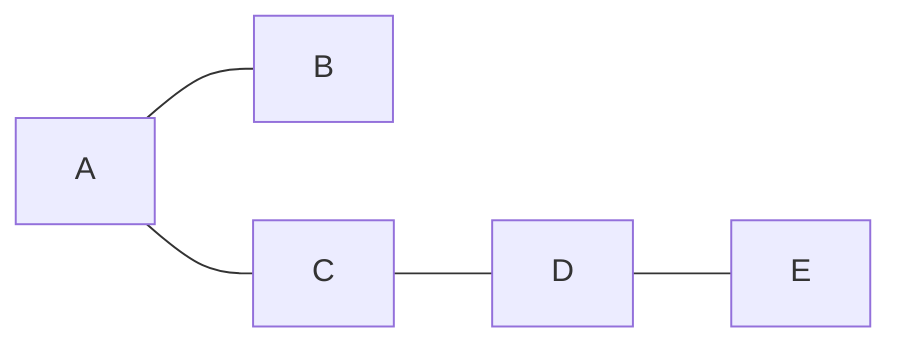
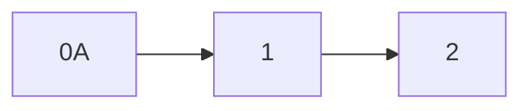
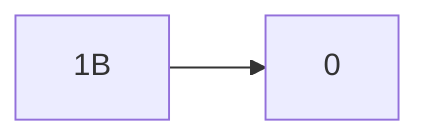
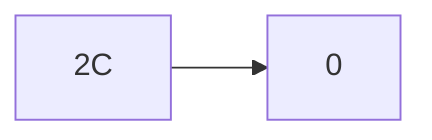
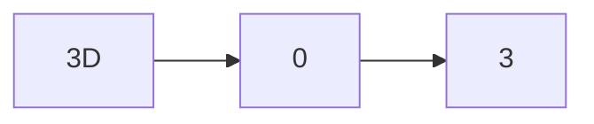
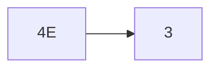

## Graph

### 定义
至少包含一个点的集合，称为图
| Index | 无向图 （n个顶点 e条边）| 有向图 |
|--|--|--|
|定义|  V = {A,B,C,D,E} E = {(A,B),(A,C)} | V = {A,B,C,D,E} E = {<A,B>,<A,C>}|
|简单图|没有重复的边，也没有连接到自身的边|--|
|复杂图|有重复边或者有|--|
|完全图|每两个顶点间都有边连接 n(n-1)/2条边|n(n-1)条边|
|图形|‘-’链接|‘->’链接|
|连通|任意两个顶点之间都互相链接（连同子图）|（强连通子图）|
|极大连通分量|如果本身就是(强)连通的图那么就是自身|--|
|极小连通分量|（连通图）n-1条边|n条边|
|度|该顶点的连接的边的个数 2e|出的+入度 （“出度”->“入度”）|
|生成树|连通无向图的极小连通子图（不唯一）|--|
|生成森林|非连通无向图的极小连通子图（不唯一）|--|


### 数据结构
`V = {A,B,C,D,E}  `

无向图：

结点数组：
|A|B|C|D|E|
|--|--|--|--|--|
|0|1|2|3|4|

#### 1、邻接矩阵法
用矩阵的方式把所有结点间的关系记录下来，适用于稠密图
无向图 $ A[i][j] : Vi - Vj,$ 关于主对角线对称
有向图 $ A[i][j] : Vi \rightarrow Vj,$
网     矩阵中的内容可以是权重，无连接的结点可以表示为 $ 0、 \infty $
||A|B|C|D|E|
|--|--|--|--|--|--|
|A|0|1|1|0|0|
|B|1|0|0|0|0|
|C|1|0|0|1|0|
|D|0|0|1|0|1|
|E|0|0|0|1|0|
```C++
#define MaxVCount 100
typeof char Vtype;
typeof int Etype;
typeof struct{
    Vtype Vex [MaxVCount];
    Etype Edge[MaxVCount][MaxVCount];
    int Vcount,Ecount;
}MGraph
```
#### 2、邻接表法
当前结点所链接的所有的结点组成一个链表，
链表中的内容为：结点数组的Index+指向下一个节点的指针










```C++
//定义链表结构
#define MaxVCount 100
typeof struct ArcNode{
    int Vindex;
    struct ArcNode *Next;
}ArcNode;

//定义每一个节点的结构：
typeof struct VNode{
    Vtype data;
    ArcNode *first;
}VNode;

//定义邻接表
typeof struct{
    VNode Vlist[MaxVCount];
    int Vcount,Ecount;
}ALGraph;
```

#### 3、十字链表法（有向图的一种链式存储结构）
邻接表法：在有向图中根据当前结点可以方便的检索到与之链接出结点，但是要查找对应的入结点比较麻烦
因此引入十字链表法
链表内容（边的信息）
|Vi|Vj|同入的下一个边|同出的下一个边|
|--|--|--|--|

```C++
//定义链表结构
typeof struct ArcNode{
    int i,j;
    struct ArcNode *iNext,*jNext;
}ArcNode;

//定义每一个节点的结构：
typeof struct VNode{
    Vtype data,
    ArcNode *firstIn,*firstOut;
}VNode;

//定义十字链接表
typeof struct {
    VNode VList[MaxVCount];
    int Vcount,Ecount;
}GLGraph;
```

#### 4、邻接多重表
